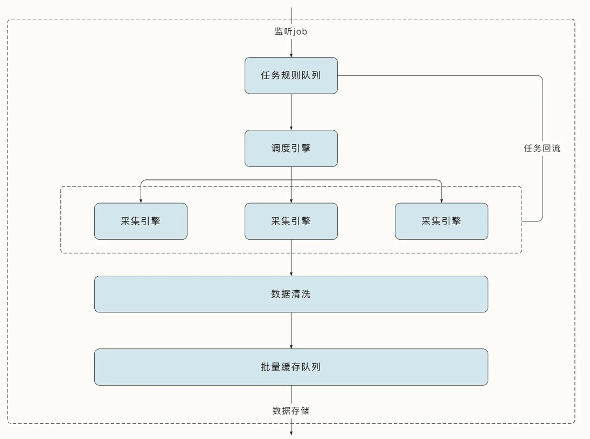

# 需求分析  

## 功能性模块的设计  

### 爬虫引擎的任务来自于哪里  

- 提前规划好的新闻网站与论坛，这被称为种子网站  
- 用户通过界面和 API 接口动态增加或修改的任务  

因此，我们需要有一个功能模块负责任务的配置与管理，这个模块可以读取配置文件中预先指定的任务列表，并能够存储后面用户动态新增的任务。同时我们还需要有接口可以灵活地对任务进行增删查改，了解任务当前的状态。

### 调度引擎  

- 将任务均衡地分发到对应的采集模块中，分别进行处理  
- 接收新的任务并存储到队列中  

### 采集引擎  

获取到任务与规则后会进行相应的采集工作，解析出相关的页面信息。  

### 任务管理模块  

- 限制器负责控制任务的采取频率  
- 代理器用于隐藏源 IP，突破服务器的反爬机制  
- 去重器用于避免重复任务  
- 随机 UA 用于生成随机的 User-Agent  
- 任务优先级队列用于为任务分级，高优先级的任务先执行；失败处理器可以处理采取失败后的重试问题  

### 存储引擎  

将数据存储到不同类型的数据库或文件当中。  

Worker流程图：  
  

## 非功能性模块的设计  

### 扩展性  

希望服务能够随着任务数量的增加而扩展，希望它能够快速增加 Worker 程序的数量，帮助我们应对更多的爬虫任务。这要求 Worker 服务是无状态的，任务可以在任何 Worker 中运行，并且具有相同的行为。

### 可用性  

我们假设产品对于服务的可用性有比较高的要求，如果少数服务崩溃，不应该影响到服务的运行。这时我们就需要考虑分布式系统的容错问题。由于现在我们有了两种类型的服务，一个是 Master，一个是 Worker。因此我们需要单独考虑它们的容错性。  

- 当 Worker 崩溃后，运行在其中的任务将无法运行。因此，我们希望 Master 能够监控到 Worker 的数据变化，并且 Master 能够通过任务的重新分配将崩溃节点的任务分散到其他 Worker 中。当 Worker 重新恢复后也有类似的过程。不过由于 Worker 无状态，不用考虑 Worker 崩溃之后数据的不一致问题。  
- 对于 Master 节点，它的主要任务是完成调度工作，本身不需要实现多高的并发量，任务的调度和分配在一个程序中就能搞定。但是为了解决故障容错问题，我们需要有多个 Master 随时待命，这会需要对多个 Master 进行选主，客户端只能与 Master 的 Leader 节点进行交互，并且只有 Master 的 Leader 节点能够调度任务到 Worker。

## 核心功能  

## 架构设计  

